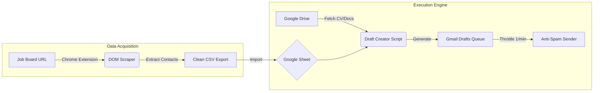

<div align="center">

# 🤖 Ausbildung Application Automator

### End-to-End Recruitment Outreach System


<p align="center">
  <em>A full-stack automation suite designed to streamline the apprenticeship application process in Germany, converting a 40-hour/week manual grind into a 10-minute workflow.</em>
</p>

</div>

---

## 📉 The Problem: The "Application Grind"

Finding an 'Ausbildung' (apprenticeship) in Germany is a numbers game. Candidates often face:

* **Inefficiency:** Manually copying emails from hundreds of listings takes hours.
* **Low Response Rate:** Generic "Copy-Paste" applications are ignored.
* **Volume Limits:** Platforms make it physically impossible to apply to 50+ companies/day manually.

> **Impact:** My peers were spending weeks sending applications with zero replies. The process needed **Scale** and **Personalization**.

---

## 🛠️ The Solution: Automated Outreach Pipeline

I engineered a two-stage system: a **Chrome Extension** for data harvesting and a **Google Apps Script** engine for personalized, anti-spam email dispatch.

### 🔄 System Architecture



⚙️ Core Components

### 1. The Harvester (Chrome Extension)

Built on Manifest V3, this extension automates the data collection layer.

* **Headless Navigation:** Iterates through pagination and opens job details in background tabs.
* **Smart Extraction:** Uses heuristic DOM selectors to identify Contact Person, Email, and Company Name even on inconsistent layouts.
* **Target Sites:** Optimized for gastrojobs.de, aubi-plus, and ausbildungsheld.

### 2. The Mailer (Google Apps Script)

A server-side engine running on Google Cloud to handle the "Human Touch".

* **Dynamic Personalization:** Detects the contact's name to generate specific salutations:

  * "Sehr geehrte Frau Müller..." (if female name detected)
  * "Sehr geehrter Herr Schmidt..." (if male name detected)
  * "Sehr geehrte Damen und Herren..." (fallback)
* **Context Awareness:** Automatically attaches the correct PDF documents (CV, Cover Letter) from Google Drive.

### 3. The Anti-Spam Protocol

To ensure high deliverability and avoid Gmail's spam filters:

* **Time-Based Trigger:** The AntiSpamSender.js script runs on a 1-minute cron job.
* **Throttling:** Dispatches exactly one email per minute. Mimics human behavior, ensuring account safety.

📂 Project Structure

```
Job-Application-Automator/
├── extension/                  # Chrome Extension Source
│   ├── manifest.json           # Manifest V3 Config
│   ├── background.js           # Tab & State Management
│   ├── content.js              # DOM Scraping Logic
│   └── popup.html              # UI Control
├── google_scripts/             # Cloud Automation
│   ├── DraftCreator.js         # Template Engine
│   └── AntiSpamSender.js       # Throttling Logic
└── README.md
```

🚀 Results

* **Throughput:** Capable of processing 500+ applications in a single run.
* **Success Rate:** Helped 3 candidates secure contracts within 2 weeks of deployment.
* **Efficiency:** Reduced daily workload from 4 hours to ~15 minutes (monitoring).

⚠️ Disclaimer

<div align="center">
  Educational Purpose Only
</div>

This software demonstrates browser automation and API integration capabilities. The author (Redouane Boundra) is **not responsible** for misuse, including spamming or violations of platform TOS or data privacy laws. Users are responsible for GDPR and local anti-spam law compliance.

Use responsibly and ethically.

Engineered by Redouane Boundra.
